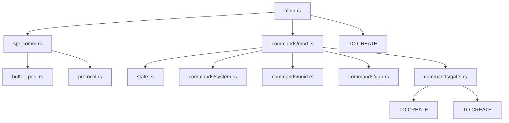

# BLE Modem Code Status Summary

## Overview
This document provides a detailed breakdown of what code exists versus what needs to be implemented for the BLE modem project.

## Existing Code Analysis

### ✅ **Complete Modules**
These modules are fully implemented and ready to use:

| Module | File | Status | Notes |
|--------|------|--------|-------|
| **Buffer Pool** | `src/buffer_pool.rs` | ✅ 100% | Uses atomic-pool, TX/RX buffers ready |
| **Protocol Definitions** | `src/protocol.rs` | ✅ 95% | All commands defined, missing CRC16 |
| **State Management** | `src/state.rs` | ✅ 100% | Complete modem state structure |
| **SPI Communication** | `src/spi_comm.rs` | ✅ 90% | Tasks complete, missing CRC validation |

### ⚠️ **Partial Modules**
These modules have framework/structure but need implementation:

| Module | File | Status | What Exists | What's Missing |
|--------|------|--------|-------------|----------------|
| **Command Router** | `src/commands/mod.rs` | 70% | Routing logic, processor task | Handler implementations |
| **System Commands** | `src/commands/system.rs` | 10% | File exists | All command handlers |
| **UUID Commands** | `src/commands/uuid.rs` | 10% | File exists | All command handlers |
| **GAP Commands** | `src/commands/gap.rs` | 20% | Stubs for all commands | Actual implementations |
| **GATTS Commands** | `src/commands/gatts.rs` | 20% | Stubs for all commands | Actual implementations |
| **Main** | `src/main.rs` | 40% | BLE working, basic structure | SPI tasks, command processor |

### 🔴 **Missing Modules**
These modules need to be created from scratch:

| Module | File | Purpose | Priority |
|--------|------|---------|----------|
| **Dynamic GATT** | `src/gatt_builder.rs` | Runtime service creation | High |
| **Dynamic Server** | `src/dynamic_server.rs` | Replace static services | High |
| **Event System** | `src/events.rs` | BLE event forwarding | High |
| **Connection Manager** | `src/connection.rs` | Connection state tracking | Medium |
| **CRC16** | In `protocol.rs` | Message validation | High |

## Integration Status

### What's Working
1. ✅ BLE advertising and connections (test_connection.rs proves this)
2. ✅ Static GATT services via macros
3. ✅ Embassy async runtime
4. ✅ SoftDevice configuration

### What's NOT Integrated
1. ❌ SPI tasks not spawned in main.rs (commented out)
2. ❌ Command processor not spawned in main.rs
3. ❌ No event forwarding system
4. ❌ No dynamic GATT services
5. ❌ No CRC16 validation

## Immediate Action Items

### Phase A Completion (2-3 hours)
```rust
// 1. Add to Cargo.toml
crc = "3.0"

// 2. In protocol.rs, add:
- CRC16 calculation function
- CRC16 validation in packet parsing
- CRC16 addition in packet serialization

// 3. In main.rs, spawn:
- spi_tx_task
- spi_rx_task
- command_processor_task

// 4. Create test_spi_loopback.rs
```

### Phase B Completion (4-6 hours)
```rust
// In commands/system.rs:
- Implement get_info()
- Implement get_version()
- Implement echo()
- Implement shutdown()
- Implement reboot()

// In commands/uuid.rs:
- Implement register_uuid_group()
- Implement remove_uuid_base()
- Implement remove_all_uuid_bases()

// In commands/gap.rs:
- Implement basic GAP commands (at least):
  - get_addr()
  - set_name()
  - adv_start()
  - adv_stop()
```

### Phase C Implementation (8-10 hours)
```rust
// Create gatt_builder.rs:
- ServiceBuilder wrapper
- Dynamic characteristic addition
- Handle management

// Create dynamic_server.rs:
- Implement Server trait
- Handle write callbacks
- Forward to host

// In commands/gatts.rs:
- Implement service_add()
- Implement characteristic_add()
- Implement hvx()
```

### Phase D Implementation (6-8 hours)
```rust
// Create events.rs:
- Event capture from SoftDevice
- Event serialization
- Event forwarding task

// Complete gap.rs:
- Connection parameter updates
- PHY updates
- RSSI monitoring
```

## File Dependencies



## Testing Requirements

### Unit Tests Needed
- [ ] CRC16 calculation/validation
- [ ] Packet serialization/parsing with CRC
- [ ] Command handler responses
- [ ] State management operations

### Integration Tests Needed
- [ ] SPI loopback test
- [ ] Command-response flow
- [ ] GATT service creation
- [ ] Event forwarding
- [ ] Full modem flow

## Estimated Timeline

| Task | Hours | Dependencies |
|------|-------|-------------|
| Fix Phase A (CRC16 + integration) | 2-3 | None |
| Complete Phase B (command handlers) | 4-6 | Phase A |
| Implement Phase C (dynamic GATT) | 8-10 | Phase B |
| Implement Phase D (events + GAP) | 6-8 | Phase C |
| Testing & Integration | 4-6 | All phases |
| **Total** | **24-33 hours** | |

## Critical Path

1. **Enable SPI in main.rs** - Without this, nothing works
2. **Add CRC16** - Protocol won't be compatible without it
3. **Implement basic commands** - Need GetInfo at minimum
4. **Dynamic GATT** - Core functionality
5. **Event forwarding** - Host needs notifications

## Recommendations

### Immediate (Today)
1. Enable SPI tasks in main.rs
2. Add CRC16 dependency
3. Implement CRC16 in protocol
4. Test SPI loopback

### Short Term (This Week)
1. Complete Phase A with testing
2. Implement core Phase B commands
3. Start Phase C dynamic GATT

### Medium Term (Next Week)
1. Complete Phase C
2. Implement Phase D events
3. Full integration testing